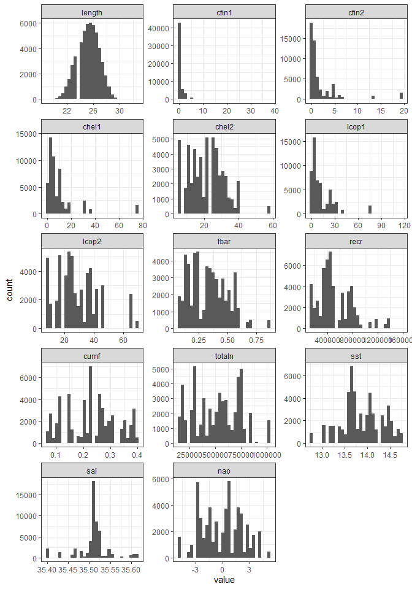
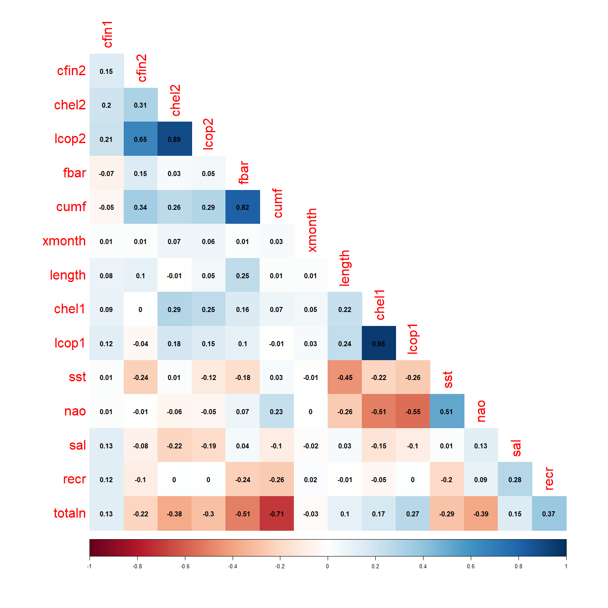
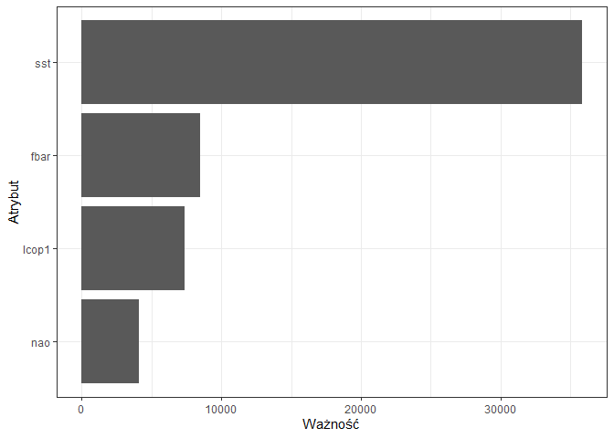

Poniższy raport przedstawia analizę danych dotyczących połowów śledzi oceanicznych w Europie na przestrzeni ostatnich kilkudziesięciu lat, w których zaobserwowany został spadek ich rozmiaru. Posiadając informacje, m.in. o występowaniu wybranych gatunków planktonu, wielkości i natężeniu połowów czy warunkach środowiska, udało się przeanalizować wpływ poszczegołnych atrybutów na długość śledzia oraz wyznaczyć model regresji, który na podstawie najsilniej skorelowanych własności jest w stanie przewidzieć rozmiar tych ryb. W wyniku przeprowadzonych badań udało się dojść do wniosku, że najbardziej na śledzie wpływają:

* natężenie połowów w regionie (*fbar*), 
* dostępność planktonu (zagęszczenie widłonogów gat. 1, *lcop1*),
* temperatura powierzchni wody (*sst*),

gdzie ta ostatnia charakterystyka okazała się mieć największy wpływ. 

## Biblioteki R


```r
library(dplyr)
library(tidyverse)
library(ggplot2)
library(plotly)
library(reshape2)
library(corrplot)
library(caret)
set.seed(23)
```

## Wczytanie danych


```r
herrings_raw <- read.csv('sledzie.csv', na.strings = "?")
```

## Dostosowanie zbioru danych

Na zbiorze danych zostały przeprowadzone operacje wyznaczenia roku poszczególnych wpisów oraz wyczyszczenia danych pustych.
Rok wyznaczono na podstawie atrybutu opisującego roczny narobek (*recr*). Założono, że dla kolejnych lat wartość ta jest unikalna, a poszczególne jej wartości występują w zbiorze w porządku chronologicznym - od najstarszego do najmłodszego połowu. W ten sposób uzyskano 52 unikalne lata połowów śledzi.
Wartości puste natomiast obliczone zostały jako wartość średnia atrybutu w danym roku połowu.


```r
ordered_recr = c()
years_in_order = c()

for (i in 1:nrow(herrings_raw)) {
  data_row <- herrings_raw[i,]
  if (data_row$recr %in% ordered_recr) {
    years_in_order <- append(years_in_order, which(ordered_recr == data_row$recr))
  } else {
    ordered_recr <- append(ordered_recr, data_row$recr)
    years_in_order <- append(years_in_order, length(ordered_recr))
  }
}

herrings <- herrings_raw %>%
              select(-X) %>%
              add_column(year = years_in_order) %>% 
              group_by(year) %>%
              mutate_at(vars(-group_cols()), list(~ ifelse(is.na(.), mean(., na.rm=TRUE), .))) %>%
              ungroup()
```

## Podsumowanie zbioru i analiza wartości atrybutów

Analizowany zbiór składa się z 52582 wierszy oraz 16 atrybutów.
Rozkład poszczególnych atrybutów prezentuje się następująco:


```r
knitr::kable(summary(herrings[,1:8]))
```


|   |    length   |    cfin1       |    cfin2       |    chel1      |    chel2      |    lcop1        |    lcop2      |     fbar      |
|:--|:------------|:---------------|:---------------|:--------------|:--------------|:----------------|:--------------|:--------------|
|   |Min.   :19.0 |Min.   : 0.0000 |Min.   : 0.0000 |Min.   : 0.000 |Min.   : 5.238 |Min.   :  0.3074 |Min.   : 7.849 |Min.   :0.0680 |
|   |1st Qu.:24.0 |1st Qu.: 0.0000 |1st Qu.: 0.2778 |1st Qu.: 2.469 |1st Qu.:13.427 |1st Qu.:  2.5479 |1st Qu.:17.808 |1st Qu.:0.2270 |
|   |Median :25.5 |Median : 0.1111 |Median : 0.7012 |Median : 5.750 |Median :21.435 |Median :  7.0717 |Median :24.859 |Median :0.3320 |
|   |Mean   :25.3 |Mean   : 0.4462 |Mean   : 2.0258 |Mean   :10.003 |Mean   :21.219 |Mean   : 12.8080 |Mean   :28.422 |Mean   :0.3304 |
|   |3rd Qu.:26.5 |3rd Qu.: 0.3333 |3rd Qu.: 1.7936 |3rd Qu.:11.500 |3rd Qu.:27.193 |3rd Qu.: 21.2315 |3rd Qu.:37.232 |3rd Qu.:0.4560 |
|   |Max.   :32.5 |Max.   :37.6667 |Max.   :19.3958 |Max.   :75.000 |Max.   :57.706 |Max.   :115.5833 |Max.   :68.736 |Max.   :0.8490 |

```r
knitr::kable(summary(herrings[,9:16]))
```


|   |     recr       |     cumf       |    totaln      |     sst      |     sal      |    xmonth     |     nao         |     year     |
|:--|:---------------|:---------------|:---------------|:-------------|:-------------|:--------------|:----------------|:-------------|
|   |Min.   : 140515 |Min.   :0.06833 |Min.   : 144137 |Min.   :12.77 |Min.   :35.40 |Min.   : 1.000 |Min.   :-4.89000 |Min.   : 1.00 |
|   |1st Qu.: 360061 |1st Qu.:0.14809 |1st Qu.: 306068 |1st Qu.:13.60 |1st Qu.:35.51 |1st Qu.: 5.000 |1st Qu.:-1.89000 |1st Qu.:10.00 |
|   |Median : 421391 |Median :0.23191 |Median : 539558 |Median :13.86 |Median :35.51 |Median : 8.000 |Median : 0.20000 |Median :19.00 |
|   |Mean   : 520367 |Mean   :0.22981 |Mean   : 514973 |Mean   :13.87 |Mean   :35.51 |Mean   : 7.258 |Mean   :-0.09236 |Mean   :21.97 |
|   |3rd Qu.: 724151 |3rd Qu.:0.29803 |3rd Qu.: 730351 |3rd Qu.:14.16 |3rd Qu.:35.52 |3rd Qu.: 9.000 |3rd Qu.: 1.63000 |3rd Qu.:34.00 |
|   |Max.   :1565890 |Max.   :0.39801 |Max.   :1015595 |Max.   :14.73 |Max.   :35.61 |Max.   :12.000 |Max.   : 5.08000 |Max.   :52.00 |


```r
attributes <- herrings %>% select(-c(xmonth, year)) %>% melt()
ggplot(attributes, aes(x = value)) + 
  facet_wrap(~variable, scales="free", ncol = 3) +
  geom_histogram() + 
  theme_bw()
```

<!-- -->

## Korelacja między atrybutami

```r
attributes_correlation <- herrings %>% select(-year) %>% cor() %>% round(2)
corrplot(attributes_correlation, 
         method = 'color',
         type = 'lower',
         diag = FALSE,
         order = 'hclust',
         addCoef.col = 'black',
         tl.cex = 2)
```

<!-- -->
Na podstawie wykresu korelacji między własnościami charakteryzującymi połów śledzi udało się wyznaczyć 5 z nich, które najsilniej korelują z długością:

* fbar 0.25,
* lcop1 0.24,
* chel1 0.22 
* sst -0.45,
* nao -0.26,

Jednak chel1 odrzucono, ponieważ koreluje on silnie z lcop1. 

## Rozmiar śledzi w czasie


```r
avg_length_by_year <- herrings %>% 
  select(length, year) %>%
  group_by(year) %>% 
  summarize(avg_length = mean(length))

length_plot <- ggplot(avg_length_by_year, aes(x = year)) + 
  geom_point(aes(y = avg_length, color = 'średnia długość')) +
  layer(
    data = herrings, 
    mapping = aes(x = year, y = length, color = 'trend'), 
    stat='smooth', 
    params=list(
      method='glm',
      formula= y~poly(x,2)),
    geom = 'smooth',
    position = position_identity()) + 
  scale_color_manual(name = '', values = c('black', 'blue')) +
  labs(x = 'Rok', y = 'Długość śledzia') +
  theme_bw()
ggplotly(length_plot)
```

```{=html}
<div id="htmlwidget-9c1bf7f2c778aa662c21" style="width:672px;height:480px;" class="plotly html-widget"></div>
<script type="application/json" data-for="htmlwidget-9c1bf7f2c778aa662c21">{"x":{"data":[{"x":[1,2,3,4,5,6,7,8,9,10,11,12,13,14,15,16,17,18,19,20,21,22,23,24,25,26,27,28,29,30,31,32,33,34,35,36,37,38,39,40,41,42,43,44,45,46,47,48,49,50,51,52],"y":[22.9909090909091,24.1015625,25.8254658385093,26.1626016260163,25.4611590628853,25.3508541392904,25.3345802161264,25.6631455399061,25.5431773236651,26.1337209302326,25.1686002239642,26.6361754966887,26.270781483325,26.4811698717949,26.5049407114624,26.85497150095,27.1266519823789,27.383137829912,27.6361573373676,27.178125,27.0328282828283,25.1634499396864,27.3069029850746,26.7460087082729,26.9510406342914,26.648195329087,26.3173395102581,23.3228840125392,26.1683673469388,25.1781695423856,25.1345128453708,25.0814350797267,25.2915407854985,25.2030423280423,24.9462242562929,24.9464980544747,23.3732101616628,25.1103723404255,24.7270511779041,24.4916666666667,24.5280172413793,24.0027624309392,24.4111531190926,24.9775725593668,23.7007607776839,23.5527210884354,23.2629815745394,23.6539393939394,24.1356466876972,23.5269179004038,23.6144164759725,25.9166666666667],"text":["year:  1<br />avg_length: 22.99091<br />colour: średnia długość","year:  2<br />avg_length: 24.10156<br />colour: średnia długość","year:  3<br />avg_length: 25.82547<br />colour: średnia długość","year:  4<br />avg_length: 26.16260<br />colour: średnia długość","year:  5<br />avg_length: 25.46116<br />colour: średnia długość","year:  6<br />avg_length: 25.35085<br />colour: średnia długość","year:  7<br />avg_length: 25.33458<br />colour: średnia długość","year:  8<br />avg_length: 25.66315<br />colour: średnia długość","year:  9<br />avg_length: 25.54318<br />colour: średnia długość","year: 10<br />avg_length: 26.13372<br />colour: średnia długość","year: 11<br />avg_length: 25.16860<br />colour: średnia długość","year: 12<br />avg_length: 26.63618<br />colour: średnia długość","year: 13<br />avg_length: 26.27078<br />colour: średnia długość","year: 14<br />avg_length: 26.48117<br />colour: średnia długość","year: 15<br />avg_length: 26.50494<br />colour: średnia długość","year: 16<br />avg_length: 26.85497<br />colour: średnia długość","year: 17<br />avg_length: 27.12665<br />colour: średnia długość","year: 18<br />avg_length: 27.38314<br />colour: średnia długość","year: 19<br />avg_length: 27.63616<br />colour: średnia długość","year: 20<br />avg_length: 27.17813<br />colour: średnia długość","year: 21<br />avg_length: 27.03283<br />colour: średnia długość","year: 22<br />avg_length: 25.16345<br />colour: średnia długość","year: 23<br />avg_length: 27.30690<br />colour: średnia długość","year: 24<br />avg_length: 26.74601<br />colour: średnia długość","year: 25<br />avg_length: 26.95104<br />colour: średnia długość","year: 26<br />avg_length: 26.64820<br />colour: średnia długość","year: 27<br />avg_length: 26.31734<br />colour: średnia długość","year: 28<br />avg_length: 23.32288<br />colour: średnia długość","year: 29<br />avg_length: 26.16837<br />colour: średnia długość","year: 30<br />avg_length: 25.17817<br />colour: średnia długość","year: 31<br />avg_length: 25.13451<br />colour: średnia długość","year: 32<br />avg_length: 25.08144<br />colour: średnia długość","year: 33<br />avg_length: 25.29154<br />colour: średnia długość","year: 34<br />avg_length: 25.20304<br />colour: średnia długość","year: 35<br />avg_length: 24.94622<br />colour: średnia długość","year: 36<br />avg_length: 24.94650<br />colour: średnia długość","year: 37<br />avg_length: 23.37321<br />colour: średnia długość","year: 38<br />avg_length: 25.11037<br />colour: średnia długość","year: 39<br />avg_length: 24.72705<br />colour: średnia długość","year: 40<br />avg_length: 24.49167<br />colour: średnia długość","year: 41<br />avg_length: 24.52802<br />colour: średnia długość","year: 42<br />avg_length: 24.00276<br />colour: średnia długość","year: 43<br />avg_length: 24.41115<br />colour: średnia długość","year: 44<br />avg_length: 24.97757<br />colour: średnia długość","year: 45<br />avg_length: 23.70076<br />colour: średnia długość","year: 46<br />avg_length: 23.55272<br />colour: średnia długość","year: 47<br />avg_length: 23.26298<br />colour: średnia długość","year: 48<br />avg_length: 23.65394<br />colour: średnia długość","year: 49<br />avg_length: 24.13565<br />colour: średnia długość","year: 50<br />avg_length: 23.52692<br />colour: średnia długość","year: 51<br />avg_length: 23.61442<br />colour: średnia długość","year: 52<br />avg_length: 25.91667<br />colour: średnia długość"],"type":"scatter","mode":"markers","marker":{"autocolorscale":false,"color":"rgba(0,0,0,1)","opacity":1,"size":5.66929133858268,"symbol":"circle","line":{"width":1.88976377952756,"color":"rgba(0,0,0,1)"}},"hoveron":"points","name":"średnia długość","legendgroup":"średnia długość","showlegend":true,"xaxis":"x","yaxis":"y","hoverinfo":"text","frame":null},{"x":[1,1.64556962025316,2.29113924050633,2.93670886075949,3.58227848101266,4.22784810126582,4.87341772151899,5.51898734177215,6.16455696202532,6.81012658227848,7.45569620253165,8.10126582278481,8.74683544303798,9.39240506329114,10.0379746835443,10.6835443037975,11.3291139240506,11.9746835443038,12.620253164557,13.2658227848101,13.9113924050633,14.5569620253165,15.2025316455696,15.8481012658228,16.493670886076,17.1392405063291,17.7848101265823,18.4303797468354,19.0759493670886,19.7215189873418,20.3670886075949,21.0126582278481,21.6582278481013,22.3037974683544,22.9493670886076,23.5949367088608,24.2405063291139,24.8860759493671,25.5316455696203,26.1772151898734,26.8227848101266,27.4683544303797,28.1139240506329,28.7594936708861,29.4050632911392,30.0506329113924,30.6962025316456,31.3417721518987,31.9873417721519,32.6329113924051,33.2784810126582,33.9240506329114,34.5696202531646,35.2151898734177,35.8607594936709,36.5063291139241,37.1518987341772,37.7974683544304,38.4430379746835,39.0886075949367,39.7341772151899,40.379746835443,41.0253164556962,41.6708860759494,42.3164556962025,42.9620253164557,43.6075949367089,44.253164556962,44.8987341772152,45.5443037974684,46.1898734177215,46.8354430379747,47.4810126582278,48.126582278481,48.7721518987342,49.4177215189873,50.0632911392405,50.7088607594937,51.3544303797468,52],"y":[24.8956405034431,24.9760162288102,25.0534867634871,25.1280521074738,25.1997122607702,25.2684672233765,25.3343169952926,25.3972615765184,25.457300967054,25.5144351668994,25.5686641760546,25.6199879945196,25.6684066222944,25.713920059379,25.7565283057733,25.7962313614774,25.8330292264914,25.8669219008151,25.8979093844486,25.9259916773919,25.9511687796449,25.9734406912078,25.9928074120805,26.0092689422629,26.0228252817551,26.0334764305571,26.0412223886689,26.0460631560905,26.0479987328219,26.047029118863,26.043154314214,26.0363743188747,26.0266891328452,26.0140987561255,25.9986031887156,25.9802024306155,25.9588964818252,25.9346853423446,25.9075690121739,25.8775474913129,25.8446207797617,25.8087888775203,25.7700517845887,25.7284095009669,25.6838620266549,25.6364093616526,25.5860515059602,25.5327884595775,25.4766202225046,25.4175467947415,25.3555681762882,25.2906843671447,25.222895367311,25.152201176787,25.0786017955729,25.0020972236685,24.9226874610739,24.8403725077891,24.7551523638141,24.6670270291489,24.5759965037934,24.4820607877478,24.3852198810119,24.2854737835858,24.1828224954696,24.0772660166631,23.9688043471663,23.8574374869794,23.7431654361023,23.6259881945349,23.5059057622774,23.3829181393296,23.2570253256916,23.1282273213634,22.996524126345,22.8619157406364,22.7244021642375,22.5839833971485,22.4406594393692,22.2944302908997],"text":["year:  1.000000<br />length: 24.89564<br />colour: trend","year:  1.645570<br />length: 24.97602<br />colour: trend","year:  2.291139<br />length: 25.05349<br />colour: trend","year:  2.936709<br />length: 25.12805<br />colour: trend","year:  3.582278<br />length: 25.19971<br />colour: trend","year:  4.227848<br />length: 25.26847<br />colour: trend","year:  4.873418<br />length: 25.33432<br />colour: trend","year:  5.518987<br />length: 25.39726<br />colour: trend","year:  6.164557<br />length: 25.45730<br />colour: trend","year:  6.810127<br />length: 25.51444<br />colour: trend","year:  7.455696<br />length: 25.56866<br />colour: trend","year:  8.101266<br />length: 25.61999<br />colour: trend","year:  8.746835<br />length: 25.66841<br />colour: trend","year:  9.392405<br />length: 25.71392<br />colour: trend","year: 10.037975<br />length: 25.75653<br />colour: trend","year: 10.683544<br />length: 25.79623<br />colour: trend","year: 11.329114<br />length: 25.83303<br />colour: trend","year: 11.974684<br />length: 25.86692<br />colour: trend","year: 12.620253<br />length: 25.89791<br />colour: trend","year: 13.265823<br />length: 25.92599<br />colour: trend","year: 13.911392<br />length: 25.95117<br />colour: trend","year: 14.556962<br />length: 25.97344<br />colour: trend","year: 15.202532<br />length: 25.99281<br />colour: trend","year: 15.848101<br />length: 26.00927<br />colour: trend","year: 16.493671<br />length: 26.02283<br />colour: trend","year: 17.139241<br />length: 26.03348<br />colour: trend","year: 17.784810<br />length: 26.04122<br />colour: trend","year: 18.430380<br />length: 26.04606<br />colour: trend","year: 19.075949<br />length: 26.04800<br />colour: trend","year: 19.721519<br />length: 26.04703<br />colour: trend","year: 20.367089<br />length: 26.04315<br />colour: trend","year: 21.012658<br />length: 26.03637<br />colour: trend","year: 21.658228<br />length: 26.02669<br />colour: trend","year: 22.303797<br />length: 26.01410<br />colour: trend","year: 22.949367<br />length: 25.99860<br />colour: trend","year: 23.594937<br />length: 25.98020<br />colour: trend","year: 24.240506<br />length: 25.95890<br />colour: trend","year: 24.886076<br />length: 25.93469<br />colour: trend","year: 25.531646<br />length: 25.90757<br />colour: trend","year: 26.177215<br />length: 25.87755<br />colour: trend","year: 26.822785<br />length: 25.84462<br />colour: trend","year: 27.468354<br />length: 25.80879<br />colour: trend","year: 28.113924<br />length: 25.77005<br />colour: trend","year: 28.759494<br />length: 25.72841<br />colour: trend","year: 29.405063<br />length: 25.68386<br />colour: trend","year: 30.050633<br />length: 25.63641<br />colour: trend","year: 30.696203<br />length: 25.58605<br />colour: trend","year: 31.341772<br />length: 25.53279<br />colour: trend","year: 31.987342<br />length: 25.47662<br />colour: trend","year: 32.632911<br />length: 25.41755<br />colour: trend","year: 33.278481<br />length: 25.35557<br />colour: trend","year: 33.924051<br />length: 25.29068<br />colour: trend","year: 34.569620<br />length: 25.22290<br />colour: trend","year: 35.215190<br />length: 25.15220<br />colour: trend","year: 35.860759<br />length: 25.07860<br />colour: trend","year: 36.506329<br />length: 25.00210<br />colour: trend","year: 37.151899<br />length: 24.92269<br />colour: trend","year: 37.797468<br />length: 24.84037<br />colour: trend","year: 38.443038<br />length: 24.75515<br />colour: trend","year: 39.088608<br />length: 24.66703<br />colour: trend","year: 39.734177<br />length: 24.57600<br />colour: trend","year: 40.379747<br />length: 24.48206<br />colour: trend","year: 41.025316<br />length: 24.38522<br />colour: trend","year: 41.670886<br />length: 24.28547<br />colour: trend","year: 42.316456<br />length: 24.18282<br />colour: trend","year: 42.962025<br />length: 24.07727<br />colour: trend","year: 43.607595<br />length: 23.96880<br />colour: trend","year: 44.253165<br />length: 23.85744<br />colour: trend","year: 44.898734<br />length: 23.74317<br />colour: trend","year: 45.544304<br />length: 23.62599<br />colour: trend","year: 46.189873<br />length: 23.50591<br />colour: trend","year: 46.835443<br />length: 23.38292<br />colour: trend","year: 47.481013<br />length: 23.25703<br />colour: trend","year: 48.126582<br />length: 23.12823<br />colour: trend","year: 48.772152<br />length: 22.99652<br />colour: trend","year: 49.417722<br />length: 22.86192<br />colour: trend","year: 50.063291<br />length: 22.72440<br />colour: trend","year: 50.708861<br />length: 22.58398<br />colour: trend","year: 51.354430<br />length: 22.44066<br />colour: trend","year: 52.000000<br />length: 22.29443<br />colour: trend"],"type":"scatter","mode":"lines","name":"trend","line":{"width":3.77952755905512,"color":"rgba(0,0,255,1)","dash":"solid"},"hoveron":"points","legendgroup":"trend","showlegend":true,"xaxis":"x","yaxis":"y","hoverinfo":"text","frame":null},{"x":[1,1.64556962025316,2.29113924050633,2.93670886075949,3.58227848101266,4.22784810126582,4.87341772151899,5.51898734177215,6.16455696202532,6.81012658227848,7.45569620253165,8.10126582278481,8.74683544303798,9.39240506329114,10.0379746835443,10.6835443037975,11.3291139240506,11.9746835443038,12.620253164557,13.2658227848101,13.9113924050633,14.5569620253165,15.2025316455696,15.8481012658228,16.493670886076,17.1392405063291,17.7848101265823,18.4303797468354,19.0759493670886,19.7215189873418,20.3670886075949,21.0126582278481,21.6582278481013,22.3037974683544,22.9493670886076,23.5949367088608,24.2405063291139,24.8860759493671,25.5316455696203,26.1772151898734,26.8227848101266,27.4683544303797,28.1139240506329,28.7594936708861,29.4050632911392,30.0506329113924,30.6962025316456,31.3417721518987,31.9873417721519,32.6329113924051,33.2784810126582,33.9240506329114,34.5696202531646,35.2151898734177,35.8607594936709,36.5063291139241,37.1518987341772,37.7974683544304,38.4430379746835,39.0886075949367,39.7341772151899,40.379746835443,41.0253164556962,41.6708860759494,42.3164556962025,42.9620253164557,43.6075949367089,44.253164556962,44.8987341772152,45.5443037974684,46.1898734177215,46.8354430379747,47.4810126582278,48.126582278481,48.7721518987342,49.4177215189873,50.0632911392405,50.7088607594937,51.3544303797468,52,52,52,51.3544303797468,50.7088607594937,50.0632911392405,49.4177215189873,48.7721518987342,48.126582278481,47.4810126582278,46.8354430379747,46.1898734177215,45.5443037974684,44.8987341772152,44.253164556962,43.6075949367089,42.9620253164557,42.3164556962025,41.6708860759494,41.0253164556962,40.379746835443,39.7341772151899,39.0886075949367,38.4430379746835,37.7974683544304,37.1518987341772,36.5063291139241,35.8607594936709,35.2151898734177,34.5696202531646,33.9240506329114,33.2784810126582,32.6329113924051,31.9873417721519,31.3417721518987,30.6962025316456,30.0506329113924,29.4050632911392,28.7594936708861,28.1139240506329,27.4683544303797,26.8227848101266,26.1772151898734,25.5316455696203,24.8860759493671,24.2405063291139,23.5949367088608,22.9493670886076,22.3037974683544,21.6582278481013,21.0126582278481,20.3670886075949,19.7215189873418,19.0759493670886,18.4303797468354,17.7848101265823,17.1392405063291,16.493670886076,15.8481012658228,15.2025316455696,14.5569620253165,13.9113924050633,13.2658227848101,12.620253164557,11.9746835443038,11.3291139240506,10.6835443037975,10.0379746835443,9.39240506329114,8.74683544303798,8.10126582278481,7.45569620253165,6.81012658227848,6.16455696202532,5.51898734177215,4.87341772151899,4.22784810126582,3.58227848101266,2.93670886075949,2.29113924050633,1.64556962025316,1,1],"y":[24.8634183500171,24.9456259921154,25.0248407976811,25.1010591050941,25.1742768511436,25.2444895911144,25.3116925595657,25.3758807891331,25.4370493059238,25.4951934170177,25.5503090953288,25.6023934473987,25.6514452214361,25.6974652825048,25.7404569617322,25.780426190997,25.8173813707438,25.8513329781334,25.8822929834028,25.9102741798483,25.9352895353585,25.9573516465162,25.9764723364173,25.9926624007424,26.0059314822554,26.0162880429708,26.0237394023406,26.0282918144841,26.0299505640865,26.0287200669878,26.0246039666752,26.0176052216974,26.0077261815759,25.9949686503848,25.9793339380848,25.9608229001564,25.9394359662486,25.915173158569,25.88803410066,25.8580180170965,25.8251237245341,25.789349614478,25.7506936281488,25.7091532239385,25.664725338223,25.6174063407692,25.567191986722,25.5140773682227,25.4580568701473,25.3991241362351,25.3372720538874,25.2724927678484,25.2047777342938,25.1341178267452,25.0605035027329,24.9839250343999,24.9043727970466,24.8218375979232,24.7363110158637,24.6477857142359,24.5562556887136,24.4617164192413,24.3641649109084,24.2635996270104,24.160020334002,24.0534278881692,23.943823996228,23.8312109779346,23.7155915509536,23.5969686495467,23.4753452811525,23.3507244195817,23.2231089304066,23.0925015227715,22.9589047217206,22.8223208557013,22.6827520547773,22.5402002560217,22.3946672134184,22.2461545103261,22.2461545103261,22.3427060714734,22.48665166532,22.6277665382752,22.7660522736977,22.9015106255714,23.0341435309693,23.1639531199553,23.2909417209766,23.4151118590774,23.5364662434022,23.6550077395231,23.7707393212509,23.8836639960243,23.9937846981047,24.1011041451569,24.2056246569371,24.3073479401613,24.4062748511155,24.5024051562542,24.5957373188732,24.6862683440618,24.7739937117645,24.858907417655,24.9410021251012,25.020269412937,25.0967000884129,25.1702845268289,25.2410130003281,25.308875966441,25.3738642986891,25.435969453248,25.4951835748619,25.5514995509323,25.6049110251984,25.6554123825361,25.7029987150867,25.7476657779953,25.7894099410287,25.8282281405627,25.8641178349894,25.8970769655293,25.9271039236877,25.9541975261203,25.9783569974018,25.9995819610747,26.0178724393465,26.0332288618663,26.0456520841145,26.055143416052,26.0617046617527,26.0653381707382,26.0660469015572,26.0638344976969,26.0587053749972,26.0506648181435,26.0397190812548,26.0258754837834,26.0091424877436,25.9895297358994,25.9670480239314,25.9417091749354,25.9135257854944,25.8825108234967,25.8486770822389,25.8120365319579,25.7725996498144,25.7303748362531,25.6853680231527,25.6375825416405,25.5870192567805,25.5336769167811,25.4775526281843,25.4186423639037,25.3569414310194,25.2924448556386,25.2251476703969,25.1550451098534,25.0821327292931,25.0064064655049,24.927862656869,24.8634183500171],"text":["year:  1.000000<br />length: 24.89564<br />colour: trend","year:  1.645570<br />length: 24.97602<br />colour: trend","year:  2.291139<br />length: 25.05349<br />colour: trend","year:  2.936709<br />length: 25.12805<br />colour: trend","year:  3.582278<br />length: 25.19971<br />colour: trend","year:  4.227848<br />length: 25.26847<br />colour: trend","year:  4.873418<br />length: 25.33432<br />colour: trend","year:  5.518987<br />length: 25.39726<br />colour: trend","year:  6.164557<br />length: 25.45730<br />colour: trend","year:  6.810127<br />length: 25.51444<br />colour: trend","year:  7.455696<br />length: 25.56866<br />colour: trend","year:  8.101266<br />length: 25.61999<br />colour: trend","year:  8.746835<br />length: 25.66841<br />colour: trend","year:  9.392405<br />length: 25.71392<br />colour: trend","year: 10.037975<br />length: 25.75653<br />colour: trend","year: 10.683544<br />length: 25.79623<br />colour: trend","year: 11.329114<br />length: 25.83303<br />colour: trend","year: 11.974684<br />length: 25.86692<br />colour: trend","year: 12.620253<br />length: 25.89791<br />colour: trend","year: 13.265823<br />length: 25.92599<br />colour: trend","year: 13.911392<br />length: 25.95117<br />colour: trend","year: 14.556962<br />length: 25.97344<br />colour: trend","year: 15.202532<br />length: 25.99281<br />colour: trend","year: 15.848101<br />length: 26.00927<br />colour: trend","year: 16.493671<br />length: 26.02283<br />colour: trend","year: 17.139241<br />length: 26.03348<br />colour: trend","year: 17.784810<br />length: 26.04122<br />colour: trend","year: 18.430380<br />length: 26.04606<br />colour: trend","year: 19.075949<br />length: 26.04800<br />colour: trend","year: 19.721519<br />length: 26.04703<br />colour: trend","year: 20.367089<br />length: 26.04315<br />colour: trend","year: 21.012658<br />length: 26.03637<br />colour: trend","year: 21.658228<br />length: 26.02669<br />colour: trend","year: 22.303797<br />length: 26.01410<br />colour: trend","year: 22.949367<br />length: 25.99860<br />colour: trend","year: 23.594937<br />length: 25.98020<br />colour: trend","year: 24.240506<br />length: 25.95890<br />colour: trend","year: 24.886076<br />length: 25.93469<br />colour: trend","year: 25.531646<br />length: 25.90757<br />colour: trend","year: 26.177215<br />length: 25.87755<br />colour: trend","year: 26.822785<br />length: 25.84462<br />colour: trend","year: 27.468354<br />length: 25.80879<br />colour: trend","year: 28.113924<br />length: 25.77005<br />colour: trend","year: 28.759494<br />length: 25.72841<br />colour: trend","year: 29.405063<br />length: 25.68386<br />colour: trend","year: 30.050633<br />length: 25.63641<br />colour: trend","year: 30.696203<br />length: 25.58605<br />colour: trend","year: 31.341772<br />length: 25.53279<br />colour: trend","year: 31.987342<br />length: 25.47662<br />colour: trend","year: 32.632911<br />length: 25.41755<br />colour: trend","year: 33.278481<br />length: 25.35557<br />colour: trend","year: 33.924051<br />length: 25.29068<br />colour: trend","year: 34.569620<br />length: 25.22290<br />colour: trend","year: 35.215190<br />length: 25.15220<br />colour: trend","year: 35.860759<br />length: 25.07860<br />colour: trend","year: 36.506329<br />length: 25.00210<br />colour: trend","year: 37.151899<br />length: 24.92269<br />colour: trend","year: 37.797468<br />length: 24.84037<br />colour: trend","year: 38.443038<br />length: 24.75515<br />colour: trend","year: 39.088608<br />length: 24.66703<br />colour: trend","year: 39.734177<br />length: 24.57600<br />colour: trend","year: 40.379747<br />length: 24.48206<br />colour: trend","year: 41.025316<br />length: 24.38522<br />colour: trend","year: 41.670886<br />length: 24.28547<br />colour: trend","year: 42.316456<br />length: 24.18282<br />colour: trend","year: 42.962025<br />length: 24.07727<br />colour: trend","year: 43.607595<br />length: 23.96880<br />colour: trend","year: 44.253165<br />length: 23.85744<br />colour: trend","year: 44.898734<br />length: 23.74317<br />colour: trend","year: 45.544304<br />length: 23.62599<br />colour: trend","year: 46.189873<br />length: 23.50591<br />colour: trend","year: 46.835443<br />length: 23.38292<br />colour: trend","year: 47.481013<br />length: 23.25703<br />colour: trend","year: 48.126582<br />length: 23.12823<br />colour: trend","year: 48.772152<br />length: 22.99652<br />colour: trend","year: 49.417722<br />length: 22.86192<br />colour: trend","year: 50.063291<br />length: 22.72440<br />colour: trend","year: 50.708861<br />length: 22.58398<br />colour: trend","year: 51.354430<br />length: 22.44066<br />colour: trend","year: 52.000000<br />length: 22.29443<br />colour: trend","year: 52.000000<br />length: 22.29443<br />colour: trend","year: 52.000000<br />length: 22.29443<br />colour: trend","year: 51.354430<br />length: 22.44066<br />colour: trend","year: 50.708861<br />length: 22.58398<br />colour: trend","year: 50.063291<br />length: 22.72440<br />colour: trend","year: 49.417722<br />length: 22.86192<br />colour: trend","year: 48.772152<br />length: 22.99652<br />colour: trend","year: 48.126582<br />length: 23.12823<br />colour: trend","year: 47.481013<br />length: 23.25703<br />colour: trend","year: 46.835443<br />length: 23.38292<br />colour: trend","year: 46.189873<br />length: 23.50591<br />colour: trend","year: 45.544304<br />length: 23.62599<br />colour: trend","year: 44.898734<br />length: 23.74317<br />colour: trend","year: 44.253165<br />length: 23.85744<br />colour: trend","year: 43.607595<br />length: 23.96880<br />colour: trend","year: 42.962025<br />length: 24.07727<br />colour: trend","year: 42.316456<br />length: 24.18282<br />colour: trend","year: 41.670886<br />length: 24.28547<br />colour: trend","year: 41.025316<br />length: 24.38522<br />colour: trend","year: 40.379747<br />length: 24.48206<br />colour: trend","year: 39.734177<br />length: 24.57600<br />colour: trend","year: 39.088608<br />length: 24.66703<br />colour: trend","year: 38.443038<br />length: 24.75515<br />colour: trend","year: 37.797468<br />length: 24.84037<br />colour: trend","year: 37.151899<br />length: 24.92269<br />colour: trend","year: 36.506329<br />length: 25.00210<br />colour: trend","year: 35.860759<br />length: 25.07860<br />colour: trend","year: 35.215190<br />length: 25.15220<br />colour: trend","year: 34.569620<br />length: 25.22290<br />colour: trend","year: 33.924051<br />length: 25.29068<br />colour: trend","year: 33.278481<br />length: 25.35557<br />colour: trend","year: 32.632911<br />length: 25.41755<br />colour: trend","year: 31.987342<br />length: 25.47662<br />colour: trend","year: 31.341772<br />length: 25.53279<br />colour: trend","year: 30.696203<br />length: 25.58605<br />colour: trend","year: 30.050633<br />length: 25.63641<br />colour: trend","year: 29.405063<br />length: 25.68386<br />colour: trend","year: 28.759494<br />length: 25.72841<br />colour: trend","year: 28.113924<br />length: 25.77005<br />colour: trend","year: 27.468354<br />length: 25.80879<br />colour: trend","year: 26.822785<br />length: 25.84462<br />colour: trend","year: 26.177215<br />length: 25.87755<br />colour: trend","year: 25.531646<br />length: 25.90757<br />colour: trend","year: 24.886076<br />length: 25.93469<br />colour: trend","year: 24.240506<br />length: 25.95890<br />colour: trend","year: 23.594937<br />length: 25.98020<br />colour: trend","year: 22.949367<br />length: 25.99860<br />colour: trend","year: 22.303797<br />length: 26.01410<br />colour: trend","year: 21.658228<br />length: 26.02669<br />colour: trend","year: 21.012658<br />length: 26.03637<br />colour: trend","year: 20.367089<br />length: 26.04315<br />colour: trend","year: 19.721519<br />length: 26.04703<br />colour: trend","year: 19.075949<br />length: 26.04800<br />colour: trend","year: 18.430380<br />length: 26.04606<br />colour: trend","year: 17.784810<br />length: 26.04122<br />colour: trend","year: 17.139241<br />length: 26.03348<br />colour: trend","year: 16.493671<br />length: 26.02283<br />colour: trend","year: 15.848101<br />length: 26.00927<br />colour: trend","year: 15.202532<br />length: 25.99281<br />colour: trend","year: 14.556962<br />length: 25.97344<br />colour: trend","year: 13.911392<br />length: 25.95117<br />colour: trend","year: 13.265823<br />length: 25.92599<br />colour: trend","year: 12.620253<br />length: 25.89791<br />colour: trend","year: 11.974684<br />length: 25.86692<br />colour: trend","year: 11.329114<br />length: 25.83303<br />colour: trend","year: 10.683544<br />length: 25.79623<br />colour: trend","year: 10.037975<br />length: 25.75653<br />colour: trend","year:  9.392405<br />length: 25.71392<br />colour: trend","year:  8.746835<br />length: 25.66841<br />colour: trend","year:  8.101266<br />length: 25.61999<br />colour: trend","year:  7.455696<br />length: 25.56866<br />colour: trend","year:  6.810127<br />length: 25.51444<br />colour: trend","year:  6.164557<br />length: 25.45730<br />colour: trend","year:  5.518987<br />length: 25.39726<br />colour: trend","year:  4.873418<br />length: 25.33432<br />colour: trend","year:  4.227848<br />length: 25.26847<br />colour: trend","year:  3.582278<br />length: 25.19971<br />colour: trend","year:  2.936709<br />length: 25.12805<br />colour: trend","year:  2.291139<br />length: 25.05349<br />colour: trend","year:  1.645570<br />length: 24.97602<br />colour: trend","year:  1.000000<br />length: 24.89564<br />colour: trend","year:  1.000000<br />length: 24.89564<br />colour: trend"],"type":"scatter","mode":"lines","line":{"width":3.77952755905512,"color":"transparent","dash":"solid"},"fill":"toself","fillcolor":"rgba(153,153,153,0.4)","hoveron":"points","hoverinfo":"x+y","name":"trend","legendgroup":"trend","showlegend":false,"xaxis":"x","yaxis":"y","frame":null}],"layout":{"margin":{"t":26.2283105022831,"r":7.30593607305936,"b":40.1826484018265,"l":37.2602739726027},"plot_bgcolor":"rgba(255,255,255,1)","paper_bgcolor":"rgba(255,255,255,1)","font":{"color":"rgba(0,0,0,1)","family":"","size":14.6118721461187},"xaxis":{"domain":[0,1],"automargin":true,"type":"linear","autorange":false,"range":[-1.55,54.55],"tickmode":"array","ticktext":["0","10","20","30","40","50"],"tickvals":[0,10,20,30,40,50],"categoryorder":"array","categoryarray":["0","10","20","30","40","50"],"nticks":null,"ticks":"outside","tickcolor":"rgba(51,51,51,1)","ticklen":3.65296803652968,"tickwidth":0.66417600664176,"showticklabels":true,"tickfont":{"color":"rgba(77,77,77,1)","family":"","size":11.689497716895},"tickangle":-0,"showline":false,"linecolor":null,"linewidth":0,"showgrid":true,"gridcolor":"rgba(235,235,235,1)","gridwidth":0.66417600664176,"zeroline":false,"anchor":"y","title":{"text":"Rok","font":{"color":"rgba(0,0,0,1)","family":"","size":14.6118721461187}},"hoverformat":".2f"},"yaxis":{"domain":[0,1],"automargin":true,"type":"linear","autorange":false,"range":[21.976654368974,27.9056574787197],"tickmode":"array","ticktext":["22","23","24","25","26","27"],"tickvals":[22,23,24,25,26,27],"categoryorder":"array","categoryarray":["22","23","24","25","26","27"],"nticks":null,"ticks":"outside","tickcolor":"rgba(51,51,51,1)","ticklen":3.65296803652968,"tickwidth":0.66417600664176,"showticklabels":true,"tickfont":{"color":"rgba(77,77,77,1)","family":"","size":11.689497716895},"tickangle":-0,"showline":false,"linecolor":null,"linewidth":0,"showgrid":true,"gridcolor":"rgba(235,235,235,1)","gridwidth":0.66417600664176,"zeroline":false,"anchor":"x","title":{"text":"Długość śledzia","font":{"color":"rgba(0,0,0,1)","family":"","size":14.6118721461187}},"hoverformat":".2f"},"shapes":[{"type":"rect","fillcolor":"transparent","line":{"color":"rgba(51,51,51,1)","width":0.66417600664176,"linetype":"solid"},"yref":"paper","xref":"paper","x0":0,"x1":1,"y0":0,"y1":1}],"showlegend":true,"legend":{"bgcolor":"rgba(255,255,255,1)","bordercolor":"transparent","borderwidth":1.88976377952756,"font":{"color":"rgba(0,0,0,1)","family":"","size":11.689497716895},"title":{"text":"","font":{"color":"rgba(0,0,0,1)","family":"","size":14.6118721461187}}},"hovermode":"closest","barmode":"relative"},"config":{"doubleClick":"reset","modeBarButtonsToAdd":["hoverclosest","hovercompare"],"showSendToCloud":false},"source":"A","attrs":{"2a0014746bd7":{"x":{},"y":{},"colour":{},"type":"scatter"},"2a00799f124d":{"x":{},"y":{},"colour":{}}},"cur_data":"2a0014746bd7","visdat":{"2a0014746bd7":["function (y) ","x"],"2a00799f124d":["function (y) ","x"]},"highlight":{"on":"plotly_click","persistent":false,"dynamic":false,"selectize":false,"opacityDim":0.2,"selected":{"opacity":1},"debounce":0},"shinyEvents":["plotly_hover","plotly_click","plotly_selected","plotly_relayout","plotly_brushed","plotly_brushing","plotly_clickannotation","plotly_doubleclick","plotly_deselect","plotly_afterplot","plotly_sunburstclick"],"base_url":"https://plot.ly"},"evals":[],"jsHooks":[]}</script>
```

## Przewidywanie rozmiaru śledzia

W celu znalezienia modelu regresji do przewidywania długości śledzia oceanicznego użyto dwóch metod oraz atrybutów wyznaczonych wcześniej przy użyciu wykresu korelacji.

### Regresja liniowa:

```r
training_idx <- createDataPartition(y = herrings$length, p = 0.8, list = F)
herrings_training <- herrings[training_idx, ]
herrings_testing <- herrings[-training_idx, ]

ctrl <- trainControl(method = 'repeatedcv', number = 2, repeats = 5)
linear_regression_model <- train(length ~ fbar + lcop1 + sst + nao,
                                 data = herrings_training,
                                 method = 'lm',
                                 trControl = ctrl,
                                 preProc = c('center', 'scale'))
linear_regression_prediction <- predict(linear_regression_model, newdata = herrings_testing)
print(linear_regression_model)
```

```
## Linear Regression 
## 
## 42067 samples
##     4 predictor
## 
## Pre-processing: centered (4), scaled (4) 
## Resampling: Cross-Validated (2 fold, repeated 5 times) 
## Summary of sample sizes: 21034, 21033, 21033, 21034, 21033, 21034, ... 
## Resampling results:
## 
##   RMSE      Rsquared   MAE     
##   1.432611  0.2475342  1.146875
## 
## Tuning parameter 'intercept' was held constant at a value of TRUE
```

```r
linear_regression_rmse <- sqrt(sum((linear_regression_prediction - herrings_testing$length)^2) / length(herrings_testing$length))
linear_regression_rsquared <- cor(linear_regression_prediction, herrings_testing$length) ^ 2
```

* RMSE: 1.4353405
* R^2: 0.2508745

### Random forest  

```r
#rfGrid <- expand.grid(mtry = 5:30)
rfGrid <- expand.grid(mtry = 18)
random_forest_model <- train(length ~ fbar + lcop1 + sst + nao,
                             data = herrings_training,
                             method = 'rf',
                             trControl = ctrl,
                             preProc = c('center', 'scale'),
                             tuneGrid = rfGrid, 
                             ntree = 100)
random_forest_prediction <- predict(random_forest_model, newdata = herrings_testing)
print(random_forest_model)
```

```
## Random Forest 
## 
## 42067 samples
##     4 predictor
## 
## Pre-processing: centered (4), scaled (4) 
## Resampling: Cross-Validated (2 fold, repeated 5 times) 
## Summary of sample sizes: 21033, 21034, 21033, 21034, 21033, 21034, ... 
## Resampling results:
## 
##   RMSE      Rsquared  MAE     
##   1.189827  0.480985  0.942216
## 
## Tuning parameter 'mtry' was held constant at a value of 18
```

```r
random_forest_rmse <- sqrt(sum((random_forest_prediction - herrings_testing$length)^2) / length(herrings_testing$length))
random_forest_rsuqred <- cor(random_forest_prediction, herrings_testing$length) ^ 2
```

* RMSE: 1.1829617
* R^2: 0.4912

## Analiza znalezionego modelu regresji

```r
ggplot(varImp(random_forest_model, scale = F)) + 
  labs(x = 'Atrybut', y = 'Ważność') + 
  theme_bw()
```

<!-- -->

Okzauje się, że największy wpływ na długość śledzia oceanicznego wyławianego w Europie ma temperatura powierzchni wody. Znaczenie ma również natężenie połowów w poszczególnych regionach oraz dostępność planktonu. Stopniowo rosnąca temperatura wody, spowodowana na przykład działalnością człowieka, czy efektem cieplarnianym i coraz gęstsze połowy, wynikające z rosnącego popytu na wszelkie produkty rybne, niestety wpływają negatywnie na te stworzenia i przyczyniają się do zmniejszania ich rozmiaru. 
